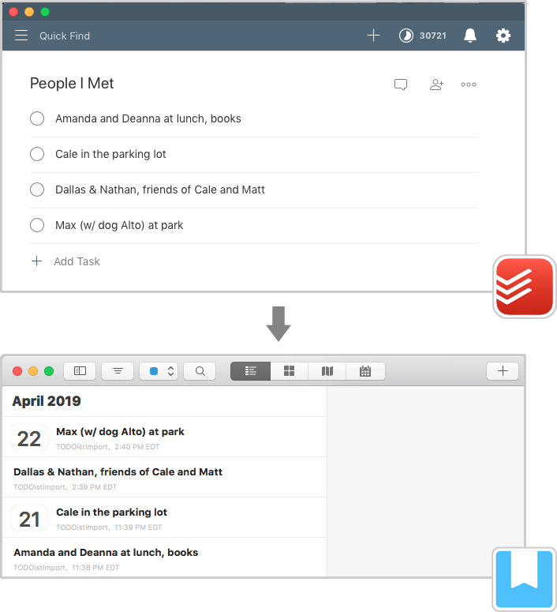

# Migrate from TODOist into DayOne

After:


## Steps
Took me 58 minutes the first time.

1. Find the TODOist access token

https://github.com/Cosmitar/todoist-js/wiki/Getting-access-token

Use it to replace `{{yourtokenhere}}` in commands below.

2. Look for `id` of project to import

```
curl https://todoist.com/api/v8/sync \
    -d token={{yourtokenhere}} \
    -d sync_token=\* \
    -d resource_types='["projects"]'
```

And search for the project you want. In this case, `"name": "People I Met"` has the value `"id": 2209339242`

3. Download all TODOist tasks
```
curl https://todoist.com/api/v8/sync \
    -d token={{yourtokenhere}} \
    -d sync_token=\* \
    -d resource_types='["items"]' > items.json
```

4. Filter by project

Update `project_id` in `script.js`, then run...

`node script.js`

If successful, resulting filtered text should appear in `array.txt`

5. Check for non-importable text

Open `array.txt`. Search for & replace strings with `--`... they will mess up on import into DayOne.

6. Import into Day One

Install DayOne CLI:
https://help.dayoneapp.com/tips-and-tutorials/command-line-interface-cli

Everything goes into the default journal.

Run `./dayOneImport.sh`

## Future Improvements
Pull requests kindly accepted.
* Import TODOist comments as well
* CLI Wizard to handle steps 1-6
* Remove need to write to files `array.txt` & `items.json`
* Test really long notes (longest note tested was 483 char)
* Test large quantity of notes (311/700 tasks in TODOist were imported with no issues)
